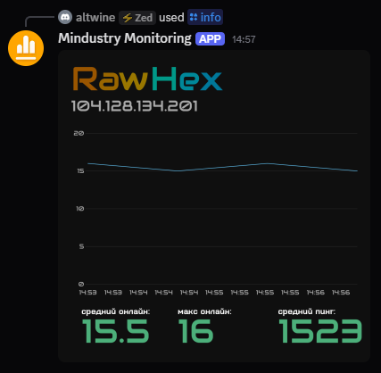

<p align="center">
	
</p>

---

# mindustry-monitoring
Collects statistics from [public mindustry servers](https://github.com/Anuken/MindustryServerList/blob/main/servers_v8.json) and displays them through a discord bot.

## Screenshots


## Local setup
**Before starting:** create a `.env` file with `DISCORD_TOKEN=...` inside the project.

### Using `go run` (dev)
```bash
$ go run .
```

### Using docker container (prod)
```bash
$ docker build -t mindustry-monitoring .
$ docker run --rm --env-file .env -p 8080:8080 mindustry-monitoring
```

# License
MIT, see [LICENSE](LICENSE)
